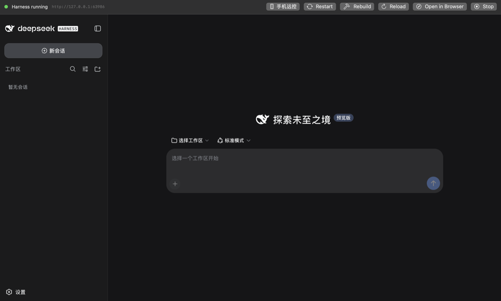
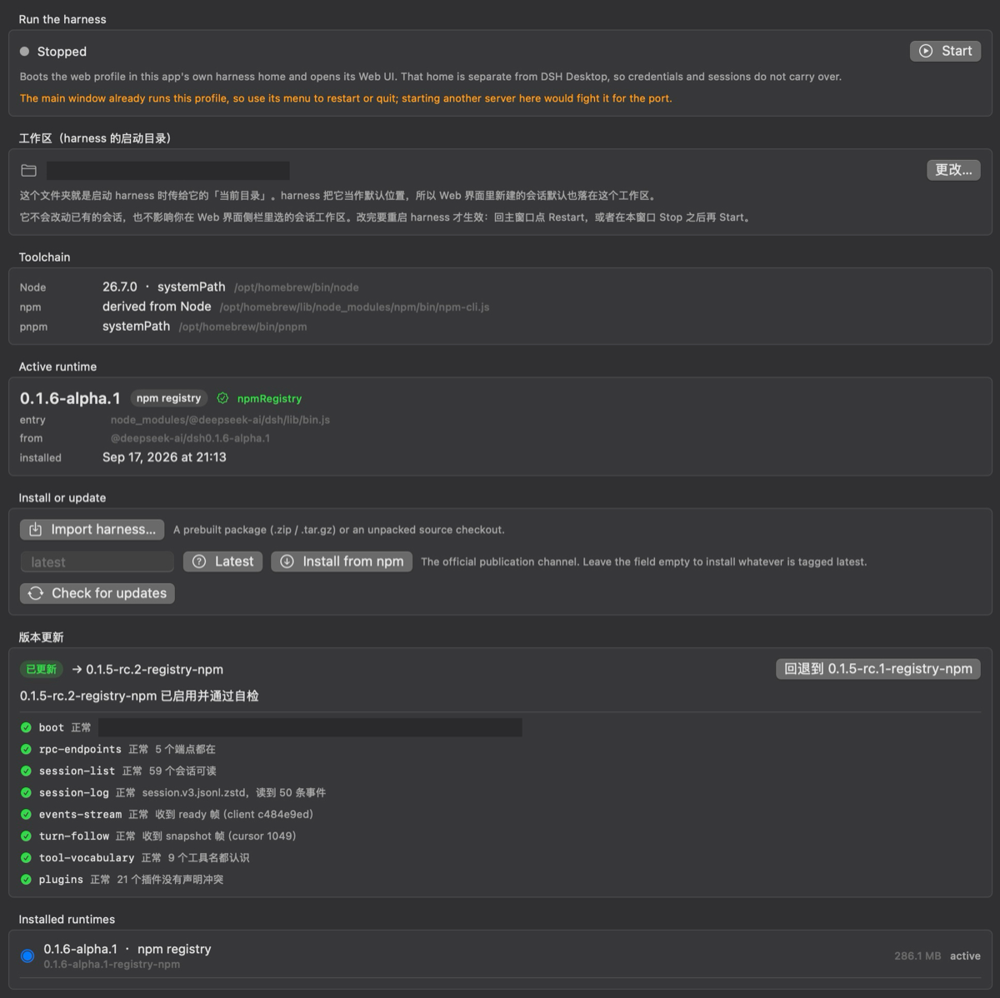
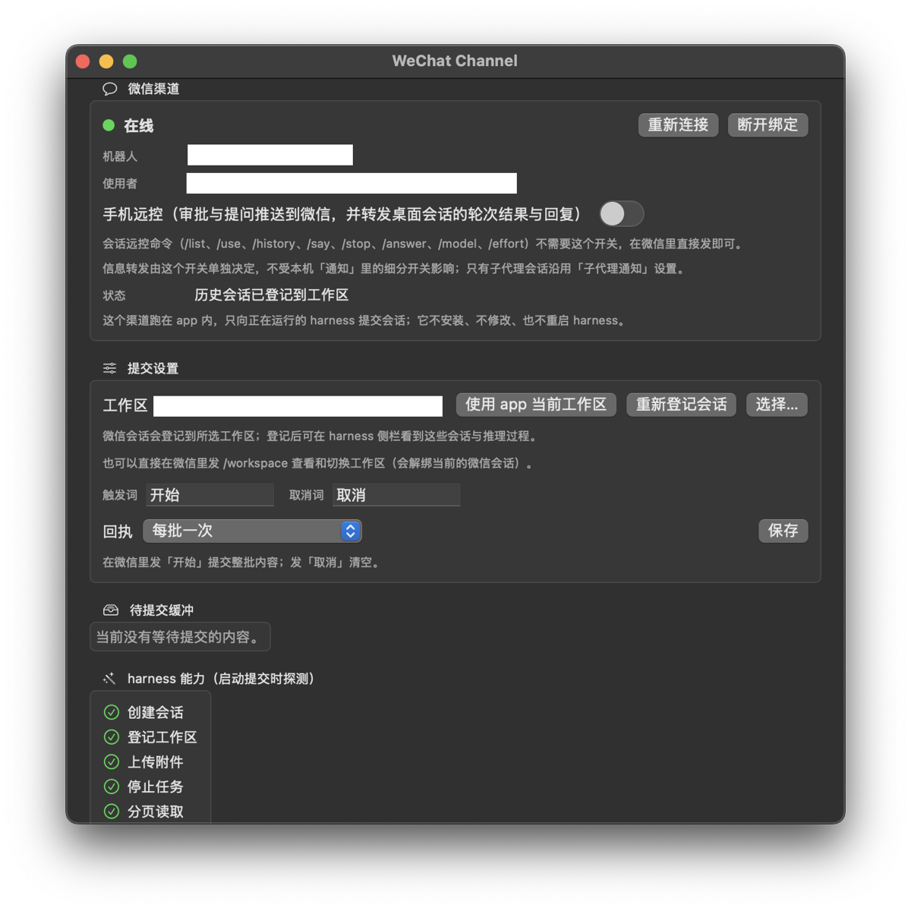
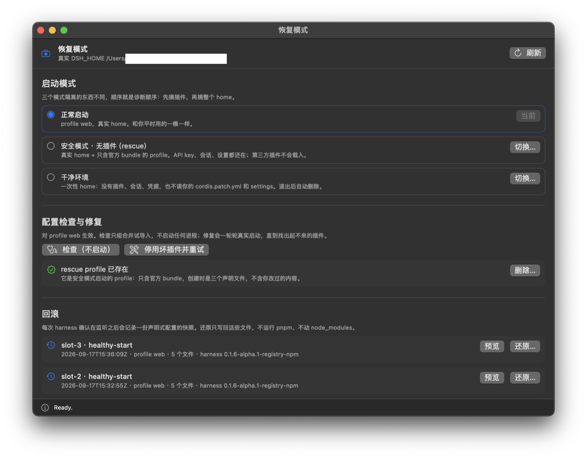
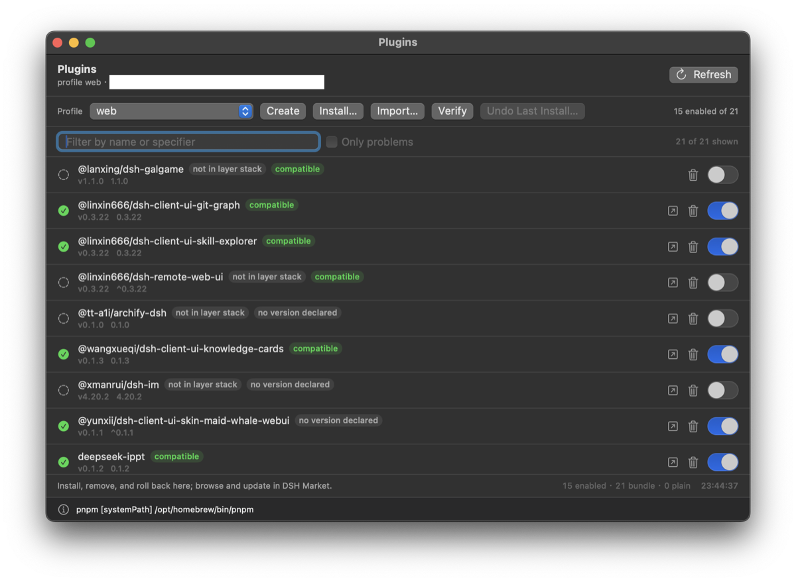
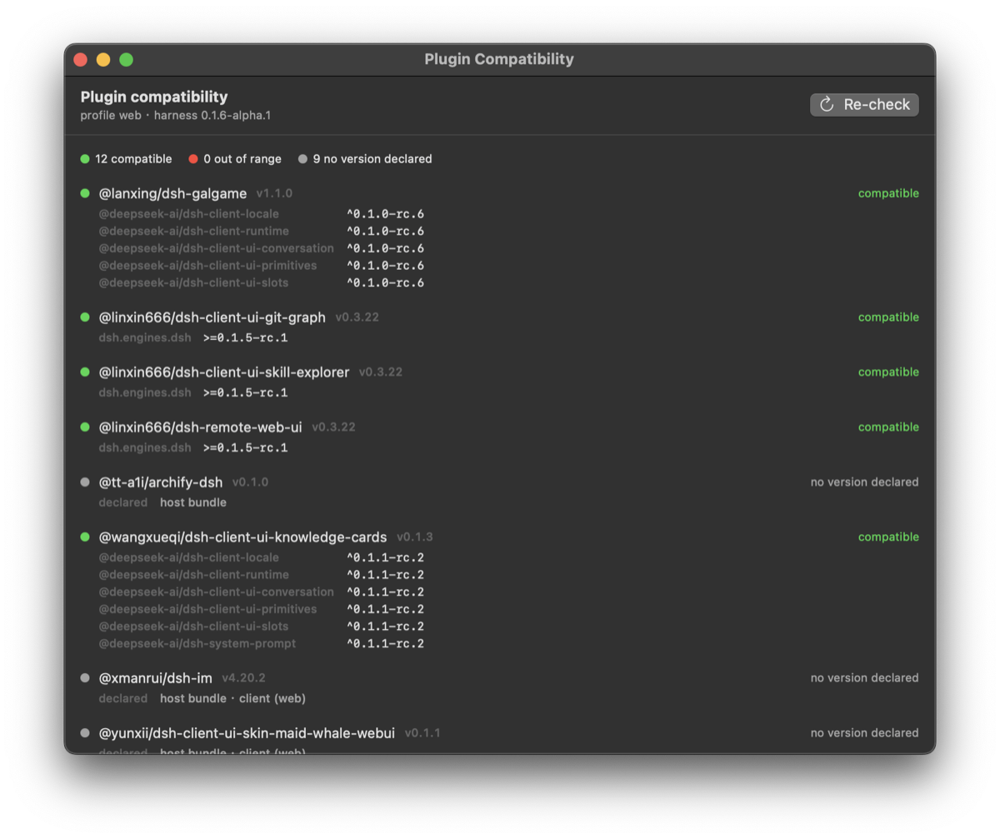

# NativeHarness (DSH Native)

[English](README.en.md) · **简体中文**

**macOS 原生 DSH 客户端：任意版本可装、升级自带体检、坏了自动退回；手机远控只要一个开关。**

*A native SwiftUI macOS shell for DeepSeek Harness — every version installable, upgrades self-checked, one-click rollback.*

[](LICENSE)
[](#环境要求)
[](Package.swift)

把 [DeepSeek Harness](https://www.npmjs.com/package/@deepseek-ai/dsh) 的 Web UI 装进一个原生 macOS
窗口：SwiftUI 外壳 + 自己管理的 harness 运行时。装 harness、换版本、备 Node、管插件都归 App，
打开就能用，不需要手动 `npm install`，也不用常驻一个浏览器标签页。

> ⚠️ **非官方项目**。第三方客户端外壳，与 DeepSeek 官方无隶属或背书关系；它下载并运行的
> `@deepseek-ai/dsh` 是官方项目，许可与条款以官方为准。应用图标含 DeepSeek 品牌标识、
> **不在 MIT 范围内**，见 [NOTICE.md](NOTICE.md)。

## 主要能力

- **原生窗口**：harness Web UI 跑在 App 窗口里，不是浏览器；缺 Node 时自动装一份私有 Node，不污染系统
- **版本管理**：兼容官方各版本，更新后自检，随时可回退到旧版本修错（见下节）
- **多窗口**：同一个 harness 的多个视图，⌥⌘N 可反复开；只有主窗口能启停服务器
- **微信 IM + 手机远控**：`/list`、`/use`、`/history`、`/say`、`/stop`、`/answer`、`/workspace`、
  `/model`、`/effort`；开启远控时先往微信发一条连通性自检，随后审批与提问推到微信，桌面会话在跑的过程中把
  每步正文（界面里那些白色中文段落）按节流批量转发，每轮结束再补一条结果；发过的正文不会在轮末重复
- **插件管理**：安装 / 卸载 / 导入 / 修复 profile 插件，并给出兼容性结论
- **皮肤管理器**：原生窗口里列出已装皮肤、一键切换、随时回到官方默认；改写 harness 自己的
  `cordis.patch.yml` 并按热载入生效，替代 `dsh-skin-manager` 这类网页插件
- **安全启动与恢复**：先摘插件、再摘整个 home 的两级退路，外加一个可回滚配置的恢复窗口
- **纯本地**：所有数据都在你自己的用户目录下，没有遥测、没有账号

## 界面

| 主窗口：harness Web UI | 控制台：版本更新 + 8 项自检 |
|---|---|
|  |  |

| 微信通道：手机远控 | 恢复模式：配置回滚 |
|---|---|
|  |  |

| 插件管理：启停 / 安装 / 修复 | 插件兼容性：逐包比对声明 |
|---|---|
|  |  |

## 和其他桌面端比，差异在哪

跨平台桌面端已经有现成的选择：官方 monorepo 的 `apps/desktop` 就是 Electron 实现（`@deepseek-ai/dsh-desktop`），
另有独立发行的 [`dataelement/dsh-desktop`](https://github.com/dataelement/dsh-desktop) 与社区 Tauri 版
[`dsh-tauri/deepseek-harness-desktop`](https://github.com/dsh-tauri/deepseek-harness-desktop)。它们覆盖
Windows / Linux 与「下载即用」。本项目只做 macOS，差异按**可信度**排序：

1. **版本可靠性**：多版本并存；升级后跑 8 项自检（`boot`、`rpc-endpoints` 是阻断项）；阻断项没过就
   **只回退一次**、不循环；正在当回退目标的版本不允许删除；升级中途崩溃，下次启动继续判定。
   证据是机器上的 `~/.nativeharness/harness/upgrade-report.json` 与 `upgrade-reports/`，不是宣传词
   （实现见 `Sources/HarnessRuntime/HarnessUpgradeCoordinator.swift`、`Sources/HarnessUI/Upgrade/`）。
2. **外壳是 SwiftUI / AppKit 本身**：不是 Web 技术栈前端 + 跨平台运行时（Electron 版外壳是 Electron，
   Tauri 版外壳是 Rust + Web 前端）。harness 自己的 Web UI 在任何一家都是网页——Electron 自带 Chromium，
   Tauri 与本项目用系统 `WKWebView`。
3. **故障处理比"重装"多两级**：安全模式（摘插件，保留真实 home）→ 干净环境（一次性 home）→
   恢复窗口回滚声明式配置（3 个轮换槽，不碰 `node_modules`）
   （实现见 `Sources/HarnessRuntime/SafeBoot.swift`、`Sources/HarnessRuntime/ProfileCheckpoint.swift`）。
4. **多窗口看同一个 harness**：多个窗口都是同一个 server 的视图（共享地址，不新起服务），
   只有主窗口能启停——不会出现一个进程两个主人（实现见 `Sources/HarnessUI/Shell/HarnessPageWindow.swift`）。
5. **手机远控开箱即用**：微信通道、审批推送、过程正文与轮次转发是内置开关，不用自己装桥接插件
   （实现见 `Sources/HarnessIM/WeChatChannelService.swift`）。
   ⚠️ 生态里同类微信插件已经有好几个（至少 8 个），这一条**不是"首个"也不是"唯一"**。

前四条是能在代码里指到具体文件与分支的差异；第五条是打包方式的差异，不算技术领先。

---

## 版本升级：高兼容 · 更新后自检 · 随时回退

### 一、对官方不同版本的高兼容

| 机制 | 做法 |
|---|---|
| 发现更新 | **双通道**：npm registry（含预发布）+ GitHub 预构建；一条不通不影响另一条 |
| 安装任意版本 | **五种来源**都能进：registry 指定版本、GitHub Release、预构建包、源码归档、源码检出（自动 pnpm 构建） |
| 装完先验 | 入口文件存在 + 真跑一次 `--version` 冒烟，通过才提交（提交是对同卷目录做原子 rename） |
| 多版本并存 | 每个 release 独立存放，随时激活任意一个；`installs.json` 记住各自的来源与版本 |
| 工具面差异 | 自检里的 `tool-vocabulary` 检查新版本播报的工具名本 App 是否都认识 |
| 插件兼容 | 按插件声明的 semver 比对 harness 包版本，结论在「插件兼容性…」（⌥⌘P）与插件列表里可见 |

### 二、更新版本后有自检

走「**下载并更新**」（或对已装版本点「**更新并重启**」）时，流程是 **激活 → 重启 → 自检**，
8 项结果写进 `~/.nativeharness/harness/upgrade-report.json`，并按时间戳另存一份历史到
`~/.nativeharness/harness/upgrade-reports/`。

| 检查项 | 看什么 | 失败是否阻断 |
|---|---|---|
| `boot` | 新版本真的起来了，并播报出地址 | **是** |
| `rpc-endpoints` | 该有的 RPC 端点都在 | **是** |
| `session-list` | 会话列表可读 | 否 |
| `session-log` | 会话日志可读（`session.v3.jsonl.zstd`） | 否 |
| `events-stream` | `$events` 能连上并收到 ready 帧 | 否 |
| `turn-follow` | 能跟到某一轮的 snapshot 帧 | 否 |
| `tool-vocabulary` | 新版本播报的工具名本 App 全都认识 | 否 |
| `plugins` | 已装插件没有声明冲突**，且新版本的启动输出里没有"插件没能加载"** | 否 |

**阻断项失败 = 直接把旧版本放回去**，并把原因（启动失败 / 哪几项没过）写进报告，界面上能直接看到。

**"能连上"不等于"插件都在"。** 这是 0.1.7 之后必须区分的一件事：新版的插件加载器会**跳过**它认为不兼容的
插件然后照常启动。进程活着、地址播报出来、8 项检查全过——而用户的插件其实没加载上。所以自检除了"服务在不在"，
还会读启动输出本身：`skipping profile bundle` / `N entry did not activate` / `<pkg>: failed to import`
都会被解析成"这个版本下没加载上的插件"，写进 `plugins` 这一项和界面横幅。

### 二·五、升级不需要你点按钮：预检 → 自动隔离 → 重试 → 安全模式

| 阶段 | 做什么 | 用户要做什么 |
|---|---|---|
| **预检** | 切换版本**之前**，用目标版本的入口把 profile 里每个插件真加载一遍；加载不起来的先禁用（记进 `native-plugin-state.json`，reason 带版本号） | 什么都不用做 |
| **启动** | 正常启动；启动失败则按输出指认的包名禁用后**再启动一次** | 什么都不用做 |
| **体检** | 启动成功但输出里有插件问题 → 隔离可证实的那些再启动一次；仍缺就写进报告与横幅 | 什么都不用做 |
| **重试** | 升级路径里只重试一次（不循环），仍不行就回退到旧版本 | 什么都不用做 |
| **跨启动** | 下次启动发现新版本还是起不来：第 1 次回退；第 2 次自动写安全模式标记并重启；第 3 次停止自动动作并建议回退 | 第 2 次会看到 App 自己以安全模式（无插件）打开 |

被隔离的插件是**可逆**的：插件窗口与「插件兼容性…」窗口都显示"这是 App 为 0.1.7-rc.1 隔离的"，一键
「恢复并重试」会把它放回 bundle 列表并重新启动；记录只对**那个版本**生效，用户自己关掉的插件不会被顺手打开。
「插件兼容性…」窗口另有 **Load-test** 按钮：对当前版本真加载一遍，失败的直接给出"隔离这些插件"。

判据是机器上的两份文件：`~/.nativeharness/harness/upgrade-report.json` 里的
`pluginPreflight` / `pluginQuarantined`，以及 `~/.nativeharness/harness/boot-strikes.json` 里的连续失败计数。

### 三、随时切回旧版本去修错

- **自动回退**：新版本起不来，或阻断项没过，自动退回原版本——只回退一次，不循环。
- **手动回退**：控制台的「版本更新」卡片与「更新并重启」，可以把运行时切到**任意一个已装版本**；
  回退走的是同一条自检路径，回退目标本身也会被验证。
- **中断安全**：升级前先写回退标记；中途崩溃或退出不会丢状态，下次启动继续判定（起来了就确认，没起来就回退）。
- **回退目标受保护**：正被当作回退目标的 release 不允许删除，避免出现"没有退路"的状态。
- **注意**：自检只挂在「下载并更新 / 更新并重启」上；列表里的 **Install** 是"只安装并激活，不重启、不检查"，
  **Activate** 是"只切换版本，不重启、不检查"。

### 四、两个实际案例

#### 升到 0.1.7-rc.1：自检"通过"，插件其实没加载

2026-09-24 升到 `0.1.7-rc.1`：启动成功、`boot` 与 `rpc-endpoints` 都是 pass，但同一次启动的输出里有
`dsh: warning: 1 entry did not activate`、`web-search-free (dsh-free-search): failed to import`，以及十几条
`skipping profile bundle "dsh-memoir" ... peerDependencies`。当时 App 判定"已更新并通过自检"，于是接下来
约 15 分钟全是手动动作：两次重启 App、关 `dsh-skin-manager`、切回 0.1.6、关 `dsh-token-optimizer`、再切回 0.1.7。

现在这条路径变成：预检发现 `dsh-memoir` / `dsh-free-search` 加载不起来 → 切换前就隔离 → 启动 → 自检的
`plugins` 一项写明"2 个插件在这个版本下没能加载" → 报告与窗口横幅说明隔离了谁。**没有一步需要用户点按钮。**

#### 升到 0.1.6-alpha.2 时被旧插件拦住

从 **0.1.6-alpha.1** 更新到 **0.1.6-alpha.2** 时，harness 没有起来，报的是插件相关的错——某个插件在新版本下加载
失败。插件加载器没有逐插件隔离，一个不支持的插件就能把整次启动带下去，而平时关它的界面（Web UI）正好打不开。

实际处理只用了两步：

1. 菜单栏 **Harness → Plugin…**（⇧⌘P）打开插件管理列表，把报错的那个插件**关闭**。这一步走的是 App 自己写的
   禁用清单与 `cordis.patch.yml`，不需要 harness 已经起来；
2. **完全退出 App 再重新打开**，harness 正常打开，其余插件照常加载。

结论：升级后起不来，先按"插件嫌疑"处理——关掉那个插件再重启一次，比急着重装或退回旧版本省事。
界面上的等价一键入口是 **Disable Broken Plugins and Retry**（⇧⌘R）。

---

## 环境要求

| | 要求 |
|---|---|
| 系统 | macOS 15 (Sequoia) 或更高 |
| 架构 | **Apple Silicon (arm64)** —— 见[已知限制](#已知限制) |
| 构建工具 | Xcode 16+（含命令行工具）、Swift 6、Node.js（生成 Xcode 工程用） |
| 网络 | 首次启动需要能访问 `registry.npmjs.org` 与 `nodejs.org` |

```bash
sw_vers && uname -m && xcodebuild -version && node --version
```

## 安装到启动台（Launchpad）

> 目前**尚未提供预构建安装包**：需要本机构建，Apple Silicon + Xcode 16 起步。

**没有 Apple 开发者账号也能装**：本机用 ad-hoc 签名构建，不需要证书或公证，Gatekeeper 不会拦。

```bash
cd /path/to/dsh-native-macos
Tools/build.sh release               # ① 构建 Release 版（产物在 /tmp/harness-native-build/DSHNative.app）
Tools/build.sh install --no-build     # ② 装进 ~/Applications（启动台会索引这里）
Tools/build.sh verify                 # ③ 逐项验证：包完整性、可执行文件、签名、图标、LaunchServices 注册
```

也可以一步到位：`Tools/build.sh install`（可选 `--wait` 等索引、`--system` 装全局、`--dock` 钉到程序坞、
`--quit` 先退出正在运行的 App）。改了代码重跑一次即可，启动台里还是同一个图标。

**为什么不能在 Xcode 里 ▶ Run**：Xcode 只把产物写进 `DerivedData`，而启动台只索引 `/Applications`
与 `~/Applications`；而且 Debug 产物开了 `ENABLE_DEBUG_DYLIB`，拷出来双击也跑不起来。所以必须
Release 构建 + 装进上面两个目录，这正是 `install` 做的事。

**可选**：装一个不写死版本的 `dsh` shim（设置 → 插件的安装/卸载需要 PATH 上有 `dsh`）：

```bash
Tools/build.sh shim && dsh --version
```

## 运行时目录

App 在用户目录下维护一棵自己拥有的运行时树（默认 `~/.nativeharness`，可用 `NATIVE_HARNESS_ROOT` 覆盖）：

| 路径 | 内容 |
|---|---|
| `harness/` | 各 release、`installs.json`、`current`、日志、检查点、升级报告 |
| `home/` | 交给 harness 的 `DSH_HOME`：profiles、sessions、settings、credentials |
| `runtime/` | npm 缓存等 |
| `safe-mode/` | 只在安全启动时存在：模式标记与一次性 home |

## 安全启动与恢复模式

插件加载器没有逐插件隔离，一个坏插件能把整次启动带下去，而关它的界面（Web UI）正好打不开。
菜单栏 **Harness** 提供了三个启动模式：

| 模式 | 用的 home | 用的 profile | 隔离掉的东西 |
|---|---|---|---|
| 正常启动 | 真实 | `web` | —— |
| **安全模式 · 无插件** | 真实 | `rescue`（官方 web 模板） | 第三方插件 |
| **干净环境** | 一次性 | `web` | 插件 + patch + settings + 凭据 + 会话 |

两者都复用已装好的 release 与 Node，不下载、不复制，因此结论可判定：安全模式能起来 → 插件问题；
只有干净环境能起来 → home 层问题；都起不来 → App 侧问题（恢复窗口会给结论）。

**恢复模式窗口（⌥⌘R）** 操作真实 `DSH_HOME`，四个分区：启动模式、配置检查与修复、**配置回滚**
（每次确认监听后存一份声明式配置快照，还原前先预览再停 harness）、数据与诊断。
安全模式下微信通道不启动，插件相关菜单项禁用。

## 皮肤管理器

菜单栏 **Harness ▸ 皮肤管理器…**（⇧⌘K）列出所选 profile 里装好的每一套皮肤，一键切换，
「官方默认」一键回到 DeepSeek Harness 原生外观。

**为什么是原生窗口，而不是继续用网页插件。** 皮肤改的正是 Web UI 本身：一套渲染不对的皮肤，
最先失效的就是它自己的设置页——想换掉它，得先能打开那个页面。这是本项目的通用判断
（见上文「故障处理比"重装"多两级」），所以皮肤的开关放在菜单栏里，和插件窗口同级。

**它做什么。** 切换 = 重写 profile 的 `cordis.patch.yml` 中由
`# --- dsh-skin-manager managed (auto-generated; do not edit) ---` 标记的托管段：被选中的皮肤
写一条 `- insert:` 行（若该皮肤已被 bundle 层挂载则不写），其余皮肤写
`- id: <rowId>` + `disabled: true`。profile 声明了 `patchReload: live`，所以运行中的 harness
秒级热载入，窗口里点「重载页面」即可看到新皮肤——不需要重启，也不会起第二个 server。

| 能力 | 说明 |
|---|---|
| 发现 | 扫描 `node_modules`：带 `skin.json` 的皮肤包，以及无 `skin.json` 的市场主题（有 client bundle + `insert:` 行，且包名/行 id/「立即加载 + 描述」说明它是主题） |
| 范围 | 顶层包与**所有** `@scope`（`@scope/name` 逐个走），外加聚合包里的 `<package>/skins/<id>` |
| 互斥 | 同一时刻只有一套皮肤生效；未选中的一律写 `disabled: true` |
| 识别 | 生效状态从 patch 文件读出，不另存状态文件——文件才是 loader 真正读的东西 |
| 预览 | 直接读皮肤包里的 `preview.light/dark`（随浅色/深色外观切换），不经过 HTTP |
| 市场联动 | 同步 `.dsh-market/state.json` 的 `disabled` 列表，但只改这一个键，region / groups / notes 原样保留 |
| 取代旧插件 | 检测到 `dsh-skin-manager` 等同类插件时单独提示，并可一键停用（从 `dsh.profile.bundles` 移除，可逆） |

托管段标记与旧插件逐字节相同，这是交接协议：本窗口能认出并替换插件写下的那一段（不会出现两个写入方
互相覆盖），用户换回插件时它也能继续读懂。相比被替代的 `dsh-skin-manager` 0.1.6/0.1.7，这一版修掉了：

1. **只扫一个 scope**：旧版探测 `node_modules/@`（不存在），于是 `@yunxii` 等 scope 下的皮肤永远看不见，
   当前皮肤显示为「未启用」；
2. **把皮肤市场当皮肤禁用**：旧版的非主题名单漏了 `dsh-skin-market`，导致每次切换皮肤都把市场本身关掉；
3. **漏删带 config 的 `insert:` 块**：旧版只删能解析出 id+name 的部分，`config:` 及其后内容残留；
4. **残留的重复 `disabled` 行**：本机 profile 上就有三条同一个皮肤的 `disabled: true`，不清掉的话
   刚应用的皮肤仍然是关的；
5. **每次应用多一个空行**：托管段渲染成规范形式，重复应用同一套皮肤是逐字节的 no-op，
   不会白白触发 config watcher 重载插件树。

实现：`Sources/HarnessRuntime/SkinCatalog.swift`（发现）、`Sources/HarnessRuntime/SkinManager.swift`
（切换与 patch 改写）、`Sources/HarnessConsoleUI/SkinManager{Model,Window}.swift`（窗口）。

## 从源码构建（开发者）

```bash
Tools/build.sh                       # 构建所有 target
Tools/build.sh test                  # 跑测试
Tools/build.sh build --target HarnessKit   # 只构建某个 target
Tools/build.sh xcode DSHNative       # xcodebuild 一个 scheme（Debug）
Tools/build.sh clean                 # 清理构建缓存与产物
```

必须经由脚本的原因有两个：`swift-driver` 在 `TMPDIR` 含非 ASCII 字符时会崩溃（脚本把 `TMPDIR`
固定到 ASCII 路径），以及受限环境下嵌套 `sandbox_apply` 不被允许（脚本带 `--disable-sandbox`）。
`NativeHarness.xcodeproj` 由 `Tools/gen-xcodeproj.mjs` 生成，新增源文件后重跑命令即可，不要手改 `.pbxproj`。

```
Apps/DSHNative/      @main App、窗口与菜单（SwiftUI）
Sources/
  HarnessKit/        领域模型与引擎契约（无 UI 依赖）
  HarnessCore/       Route B：harness 核心的 Swift 重实现
  HarnessRuntime/    运行时供给：安装/更新 harness、Node、插件、release 校验、升级协调
  HarnessUI/         共享 SwiftUI 界面（含升级自检）
  HarnessConsoleUI/  控制台 / 插件 / 市场窗口
  HarnessIM/         微信 IM 通道（协议、批处理、与运行中 harness 通信）
  harnessctl/        命令行工具
  CZstd/             唯一链接 vendored libzstd 的地方
Vendor/zstd/         随仓库附带的 libzstd 静态库
Tools/               构建、安装、验证脚本 + 工程生成器
Tests/               单元测试与 fixture
Spec/                向上游对齐的请求头、工具 schema、会话事件 schema
```

## 已知限制

- **仅 Apple Silicon**：`Vendor/zstd/lib/libzstd.a` 只有 arm64 切片，Intel Mac 的 x86_64 链接会失败
  （且会留下一个双击无反应的半成品 `.app`）。
- **未公证、未做 Developer ID 签名**：本机构建即装即用；打包分发会被 Gatekeeper 拦
  （需 `xattr -dr com.apple.quarantine` 或自行签名/公证）。

## 排错

| 现象 | 原因与处理 |
|---|---|
| `Failed to parse target info (malformed(json: "", ...))` | 直接跑了 `swift build` 且路径含中文，改用 `Tools/build.sh` |
| `swift build` 报 sandbox / `Operation not permitted` | 脚本已带 `--disable-sandbox`，不要绕过脚本 |
| 设置 → 插件 报 `spawn dsh ENOENT` | 跑 `Tools/build.sh shim` |
| 启动台看不到 App / 双击没反应 | 确认装在 `~/Applications` 或 `/Applications`，跑 `Tools/build.sh verify`；半成品包请重跑 `install` |
| 想整体搬走运行时目录 | 用 `Tools/relocate-root.sh`（先退出 App、同卷原子 `mv`，旧路径留软链） |
| 更新后想退回旧版本 | 控制台「版本更新」卡片或对已装版本点「更新并重启」，见[上文](#三随时切回旧版本去修错) |

`Tools/build.sh install --quit` 会接管已在运行的 harness，因此有浏览器窗口正由同一个 harness 提供服务时，
退出它会连带关掉那个窗口。

## 卸载

```bash
osascript -e 'tell application id "ai.deepseek.nativeharness.DSHNative" to quit'
rm -rf ~/Applications/DSHNative.app
rm -rf ~/.nativeharness          # 会话、配置、插件、各版本 release 全在这里，删前想清楚
rm -f /opt/homebrew/bin/dsh      # 如果装过 shim
```

## 许可

本仓库代码以 [MIT](LICENSE) 发布。上游 `@deepseek-ai/dsh` 与 harness 本体不包含在本仓库中，
其许可与条款见官方项目。
